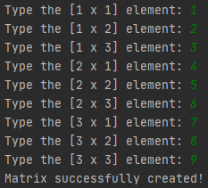

# Matrix_generator
<h3>English:</h3>
 A 3x3 matrix generator that receive nine inputs of integer numbers, and returnes a callable list with nine elements, there is also a function (printmatrix()), that allows you to print the list in a better 3x3 matrix way. This is a simple script, to work with matrix with functions, i also have a repository (a bit more avanced) to work as class, and it allow to have some funcionalities.

 <h3>Português:</h3>
 Um gerador de matriz 3x3 que recebe nove inputs de números inteiros, e retorna uma lista com nove elementos, há também disponível uma função (printmatrix()), que permite a impressão na tela numa maneira mais conhecida de uma matriz 3x3. Esse é um script simples, para trabalhar com matrizes através de funções, também tenho um repositório disponível (um pouco mais avançado) para trabalhar como classe, e também permite algumas funcionalidades
<h3>Input:</h3>
Using the first function.

    <pre style="background-color: white" class="tab">Matrix A:                               Matrix B:</pre>

 

 <h3> Output:</h3>
 Using the second function.
 
<h3>Multiplication:</h3>
Using matrix A and B, as exemple: 

<h3>Determinant:</h3>
In this case, of matrix A.

